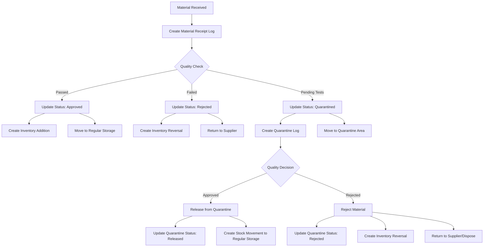

# Material Receipt, Quarantine, and Inventory Management Flow

This document outlines the integration flow between material receipt, quarantine, and inventory management in the Symmex system.

## Flow Diagram



## Process Steps

### 1. Material Receipt

1. **Material Received**
   - Physical receipt of material from supplier
   - Initial inspection of packaging and documentation

2. **Create Material Receipt Log**
   - Record receipt details (supplier, quantity, batch number, etc.)
   - Assign receipt number: `REC-YYYYMMDD-####`
   - Initial status: `Pending`
   - Create initial inventory addition transaction

3. **Quality Check**
   - Perform visual inspection
   - Check documentation
   - Collect samples for testing if required

### 2. Receipt Status Update

4. **Update Status Based on Quality Check**
   - **Approved**: Material passes all checks
   - **Rejected**: Material fails checks and is rejected immediately
   - **Quarantined**: Material requires further testing before decision

### 3. Approved Material Flow

5. **Create Inventory Addition**
   - Material is added to available inventory
   - Status: `Available`

6. **Move to Regular Storage**
   - Create stock movement record
   - Update material location

### 4. Rejected Material Flow

7. **Create Inventory Reversal**
   - Reverse the initial inventory addition
   - Record reason for rejection

8. **Return to Supplier**
   - Generate return documentation
   - Update material status

### 5. Quarantined Material Flow

9. **Create Quarantine Log**
   - Generate quarantine number: `QUA-YYYYMMDD-####`
   - Record quarantine reason
   - Set quarantine status: `Pending`

10. **Move to Quarantine Area**
    - Create stock movement record
    - Update material location to quarantine area

### 6. Quarantine Resolution

11. **Quality Decision**
    - Review test results
    - Make final disposition decision

12. **Release from Quarantine (If Approved)**
    - Update quarantine status: `Released`
    - Create stock movement to regular storage
    - Update inventory status to `Available`

13. **Reject Material (If Failed)**
    - Update quarantine status: `Rejected`
    - Create inventory reversal
    - Process return to supplier or disposal

## API Endpoints

### Material Receipt

- `POST /materialreceiptlogs` - Create new material receipt
- `PUT /materialreceiptlogs/{id}/status` - Update receipt status
- `GET /materialreceiptlogs` - Get all material receipts
- `GET /materialreceiptlogs/{id}` - Get receipt details

### Quarantine Management

- `POST /quarantinelogs` - Create new quarantine log
- `PUT /quarantinelogs/{id}/status` - Update quarantine status
- `GET /quarantinelogs` - Get all quarantine logs
- `GET /quarantinelogs/{id}` - Get quarantine details

### Stock Movement

- `POST /stockmovements` - Create new stock movement
- `GET /stockmovements` - Get all stock movements
- `GET /stockmovements/material/{materialId}` - Get movements for a material

### Inventory Management

- `POST /inventories` - Create inventory transaction
- `GET /inventories/material/{materialId}` - Get inventory for a material
- `GET /inventories/batch/{batchNumber}` - Get inventory for a batch

## Code Implementation

### Material Receipt Status Update

```csharp
public async Task<MaterialReceiptLogDto> UpdateStatusAsync(string id, MaterialReceiptStatus status, string notes, Company company)
{
    var receipt = await _context.MaterialReceiptLogs
        .Where(r => r.Id == id && r.Company!.Id == company.Id)
        .Include(r => r.InventoryTransaction)
        .FirstOrDefaultAsync();

    if (receipt == null)
    {
        throw new KeyNotFoundException($"Material receipt log with ID {id} not found");
    }

    // Handle status change
    if (receipt.Status != status)
    {
        switch (status)
        {
            case MaterialReceiptStatus.Approved:
                // Material is already in inventory from initial receipt
                // Create stock movement to regular storage
                await CreateStockMovementAsync(
                    receipt, 
                    StockMovementType.Receipt, 
                    "Material approved and moved to regular storage", 
                    company);
                break;
                
            case MaterialReceiptStatus.Rejected:
                // Create reversal inventory transaction
                await CreateInventoryReversalAsync(receipt, company);
                break;
                
            case MaterialReceiptStatus.Quarantined:
                // Create quarantine log
                await CreateQuarantineLogAsync(receipt, notes, company);
                
                // Create stock movement to quarantine location
                await CreateStockMovementAsync(
                    receipt, 
                    StockMovementType.Quarantine, 
                    "Material quarantined during receipt inspection", 
                    company);
                break;
        }
    }

    receipt.Status = status;
    receipt.Notes = string.IsNullOrEmpty(notes) ? receipt.Notes : notes;

    await _context.SaveChangesAsync();

    return await GetByIdAsync(id, company);
}
```

### Quarantine Resolution

```csharp
public async Task<QuarantineLogDto> ResolveQuarantineAsync(string id, QuarantineResolution resolution, string notes, Company company)
{
    var quarantine = await _context.QuarantineLogs
        .Where(q => q.Id == id && q.Company!.Id == company.Id)
        .Include(q => q.Material)
        .Include(q => q.QuarantinedBy)
        .FirstOrDefaultAsync();

    if (quarantine == null)
    {
        throw new KeyNotFoundException($"Quarantine log with ID {id} not found");
    }

    switch (resolution)
    {
        case QuarantineResolution.Release:
            // Update quarantine status
            quarantine.Status = QuarantineStatus.Released;
            quarantine.ResolutionDate = DateTime.UtcNow;
            quarantine.ResolutionNotes = notes;
            
            // Create stock movement from quarantine to regular storage
            await CreateStockMovementAsync(
                quarantine.Material!.Id,
                quarantine.BatchNumber,
                quarantine.Quantity,
                StockMovementType.QuarantineRelease,
                "Material released from quarantine",
                quarantine.QuarantinedBy?.Id ?? string.Empty,
                company);
            break;
            
        case QuarantineResolution.Reject:
            // Update quarantine status
            quarantine.Status = QuarantineStatus.Rejected;
            quarantine.ResolutionDate = DateTime.UtcNow;
            quarantine.ResolutionNotes = notes;
            
            // Create inventory reversal
            var inventoryDto = new InventoryDto
            {
                Type = InventoryType.Subtraction,
                Action = InventoryAction.Adjustment,
                Value = quarantine.Quantity,
                MaterialId = quarantine.Material?.Id,
                BatchNumber = quarantine.BatchNumber,
                Notes = $"Material rejected from quarantine: {quarantine.QuarantineNumber}"
            };

            await _inventoriesService.CreateAsync(
                inventoryDto, 
                quarantine.QuarantinedBy?.Id ?? string.Empty, 
                company);
            break;
    }

    await _context.SaveChangesAsync();
    
    return _mapper.Map<QuarantineLogDto>(quarantine);
}
```

## Database Schema

### MaterialReceiptLog

| Field                  | Type          | Description                           |
|------------------------|---------------|---------------------------------------|
| Id                     | string        | Primary key                           |
| ReceiptNumber          | string        | Unique receipt number                 |
| ReceivedDate           | DateTime      | Date material was received            |
| MaterialId             | string        | Foreign key to Material               |
| Quantity               | decimal       | Quantity received                     |
| BatchNumber            | string        | Batch number                          |
| LotNumber              | string        | Lot number                            |
| ExpiryDate             | DateTime?     | Expiry date                           |
| ManufacturerBatchNumber| string        | Manufacturer's batch number           |
| SupplierId             | string        | Foreign key to Supplier               |
| ManufacturerId         | string        | Foreign key to Manufacturer           |
| ReceivedById           | string        | Foreign key to User                   |
| Status                 | enum          | Receipt status                        |
| Notes                  | string        | Additional notes                      |
| InventoryTransactionId | string        | Foreign key to Inventory              |
| CompanyId              | string        | Foreign key to Company                |

### QuarantineLog

| Field                  | Type          | Description                           |
|------------------------|---------------|---------------------------------------|
| Id                     | string        | Primary key                           |
| QuarantineNumber       | string        | Unique quarantine number              |
| QuarantineDate         | DateTime      | Date material was quarantined         |
| MaterialId             | string        | Foreign key to Material               |
| Quantity               | decimal       | Quantity quarantined                  |
| BatchNumber            | string        | Batch number                          |
| LotNumber              | string        | Lot number                            |
| Reason                 | enum          | Reason for quarantine                 |
| AdditionalReason       | string        | Additional reason details             |
| QuarantinedById        | string        | Foreign key to User                   |
| Status                 | enum          | Quarantine status                     |
| ResolutionDate         | DateTime?     | Date quarantine was resolved          |
| ResolutionNotes        | string        | Notes on resolution                   |
| CompanyId              | string        | Foreign key to Company                |

### StockMovement

| Field                  | Type          | Description                           |
|------------------------|---------------|---------------------------------------|
| Id                     | string        | Primary key                           |
| MovementNumber         | string        | Unique movement number                |
| MovementDate           | DateTime      | Date of movement                      |
| MaterialId             | string        | Foreign key to Material               |
| Quantity               | decimal       | Quantity moved                        |
| Type                   | enum          | Movement type                         |
| BatchNumber            | string        | Batch number                          |
| LotNumber              | string        | Lot number                            |
| MovedById              | string        | Foreign key to User                   |
| Reason                 | string        | Reason for movement                   |
| Notes                  | string        | Additional notes                      |
| CompanyId              | string        | Foreign key to Company                |

## Status Flows

### Material Receipt Status Flow

```
Pending → Approved → Available for Use
       → Rejected → Returned to Supplier
       → Quarantined → [Quarantine Flow]
```

### Quarantine Status Flow

```
Pending → Released → Available for Use
       → Rejected → Returned to Supplier/Disposed
```

---

**Document Version:** 1.0  
**Last Updated:** December 2024  
**Maintained By:** Symmex Development Team